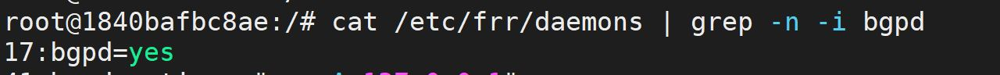
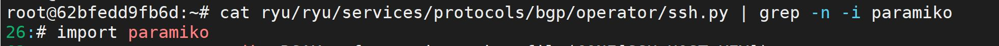
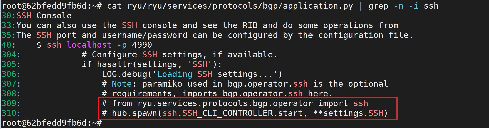
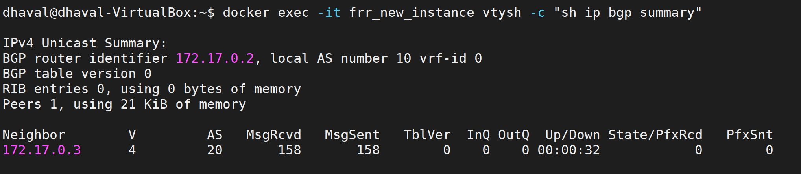
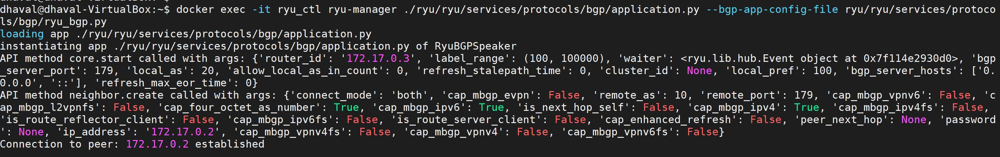

## Docker BGP automation execution with images

**Create the require template files.**

[frr.j2](../../templates/frr.j2) - For FRR routing docker 

[bgp_conf.j2](../../templates/bgp_conf.j2) - for Ryu SDN controller docker

**Now replace the dynamic fields in templates with the the given input in NSOT file and generate the new files**

For example:

In frr.j2 template file: router bgp <local_as>

Replace local_as with the actual as number from the NSOT file

Generate new file - [frr.conf](../../ConfigFiles/frr.conf)

Similarly generate new python file for Ryu controller based on [bgp_conf.j2](../../templates/bgp_conf.j2) template - [bgp_conf.py](../../templates/bgp_conf.py)

**Attach the configuration file while running the docker**

**Frrouting docker:**

_docker run -v /home/frr.conf:/etc/frr/frr.conf -itd --privileged --name <frr_docker_name> <frr_image_file>_

**Ryu docker:**

_docker run -tid -v /home/ssh.py:/root/ryu/ryu/services/protocols/bgp/operator/ssh.py
-v /home/app.py:/root/ryu/ryu/services/protocols/bgp/application.py
-v /home/bgp_conf.py:/root/ryu/ryu/services/protocols/bgp/bgp_conf.py --name <ryu_docker_name> <ryu_image_file>_

**Notes:**

In Docker container, the bgpd option needs to be enabled in /etc/frr/daemons file (line#17). After that, commit the docker container and create new image and use that image while attaching thr frr.conf file to new frr docker instance. (bgpd process requires stop/start of docker container)

In Ryu controller container, the paramiko import needs to be commented since it was throwing an error. comment out line#26 in ryu/ryu/services/protocols/bgp/operator/ssh.py comment out line#309 and line#310 in ryu/ryu/services/protocols/bgp/application.py

Now, attach these files along with bgp_conf.py file while running the ryu docker container.

Verify the BGP neighborship between FRRouting docker and Ryu docker in the application

FRRouting docker:

_docker exec -it <frr_docker_name> 'vtysh -c "show ip bgp summary"'_

Ryu Docker:

_docker exec -it " + ryu_docker_name + " ryu-manager ./ryu/ryu/services/protocols/bgp/application.py --bgp-app-config-file ryu/ryu/services/protocols/bgp/bgp_conf.py_

