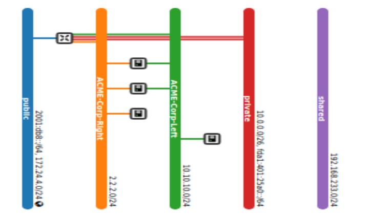
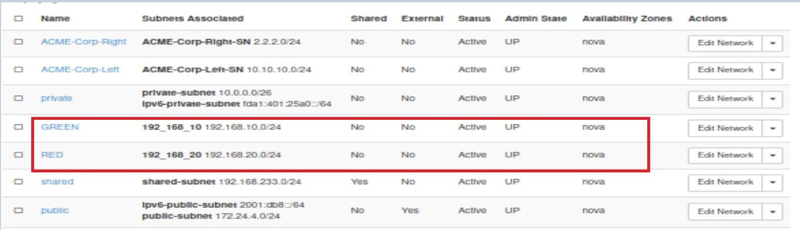
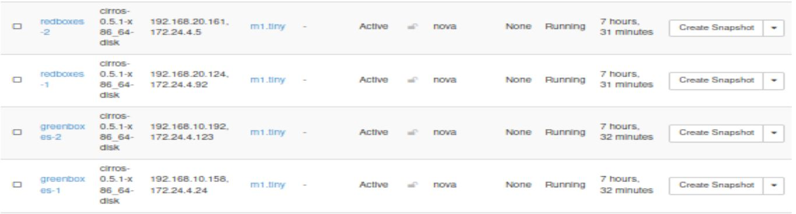
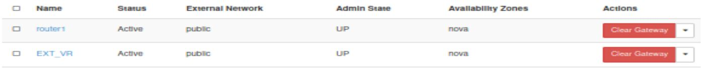
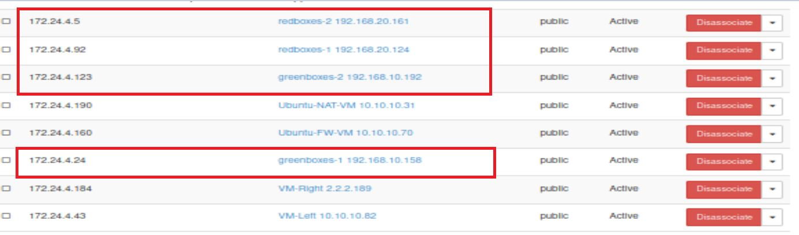
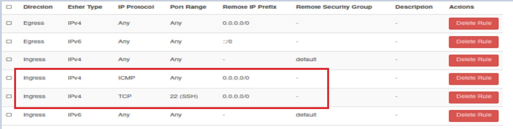

## OpenStack automation script execution with images

**Network topology before starting the code:**

**Creation of network (based on NSOT):**

neutron net-create <network_name> -f json

**Creation of subnet for the network:**

neutron subnet-create --name <subnet_name> <network_name> <subnet [192.168.10.0/24]> -f json"

**Creation of VMs:**

nova boot --flavor m1.tiny --image <vm_image_name> --min-count <vm_count> --nic net-id=<Netowrk_Id> <VM_Initial_Names>

**Creation of router (for inter and intra-communication):**

neutron router-create <router_name> -f json

**Setting the default gateway for router (for internet connection):**

neutron router-gateway-set <router_name> public

**Attaching the created subnet with the router:**

neutron router-interface-add <router_id> <subnet_name>

Creation of floating IP (based on number of VM created in point c):

neutron floatingip-create public -f json

**Find the VM port created and associate them with the floating IPs:**

neutron floatingip-associate <floating_ip_id> <vm_port_id>

**Creation of security rule:**

ICMP: openstack security group rule create --protocol icmp <default_security_group_id> -f json

SSH: openstack security group rule create --protocol tcp --dst-port 22:22 <default_security_group_id> -f json

**Note: "-f json" option is used in most commands for easily parsing the data**

