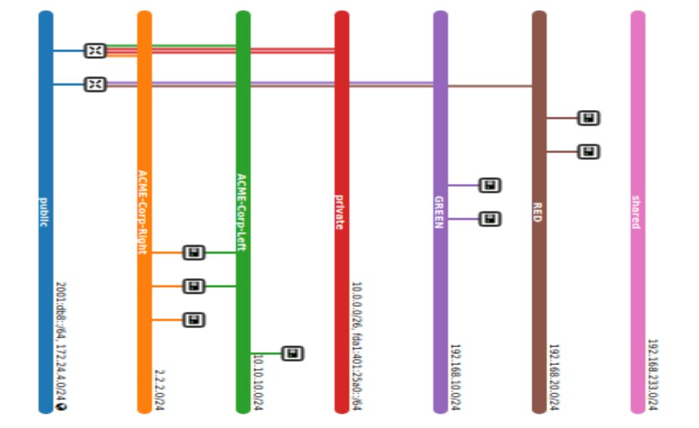

## OpenStack automation execution with images

**Network topology before starting the code:**

**Creation of network (based on NSOT):**

_neutron net-create <network_name> -f json_

**Creation of subnet for the network:**

_neutron subnet-create --name <subnet_name> <network_name> <subnet [192.168.10.0/24]> -f json"_

**Creation of VMs:**

_nova boot --flavor m1.tiny --image <vm_image_name> --min-count <vm_count> --nic net-id=<Netowrk_Id> <VM_Initial_Names>_

**Creation of router (for inter and intra-communication):**

_neutron router-create <router_name> -f json_

**Setting the default gateway for router (for internet connection):**

_neutron router-gateway-set <router_name> public_

**Attaching the created subnet with the router:**

_neutron router-interface-add <router_id> <subnet_name>_

Creation of floating IP (based on number of VM created in point c):

_neutron floatingip-create public -f json_

**Find the VM port created and associate them with the floating IPs:**

_neutron floatingip-associate <floating_ip_id> <vm_port_id>_

**Creation of security rule:**

ICMP: _openstack security group rule create --protocol icmp <default_security_group_id> -f json_

SSH: _openstack security group rule create --protocol tcp --dst-port 22:22 <default_security_group_id> -f json_

**Note: "-f json" option is used in most commands for easily parsing the data**

